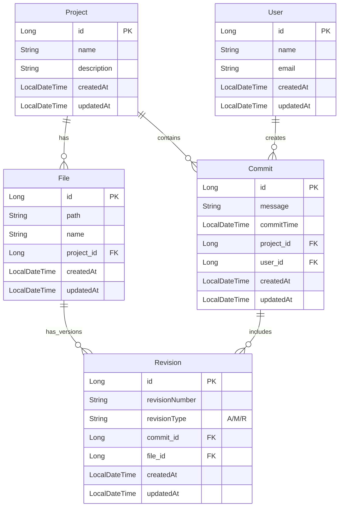
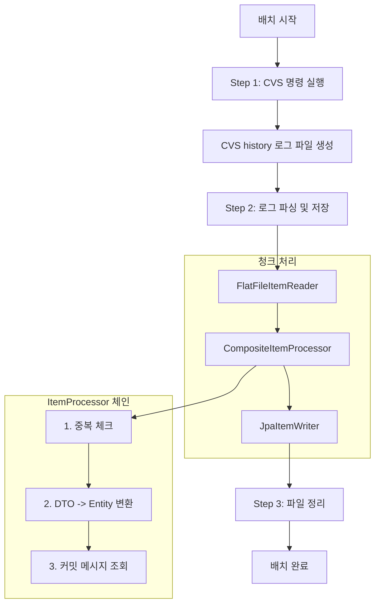
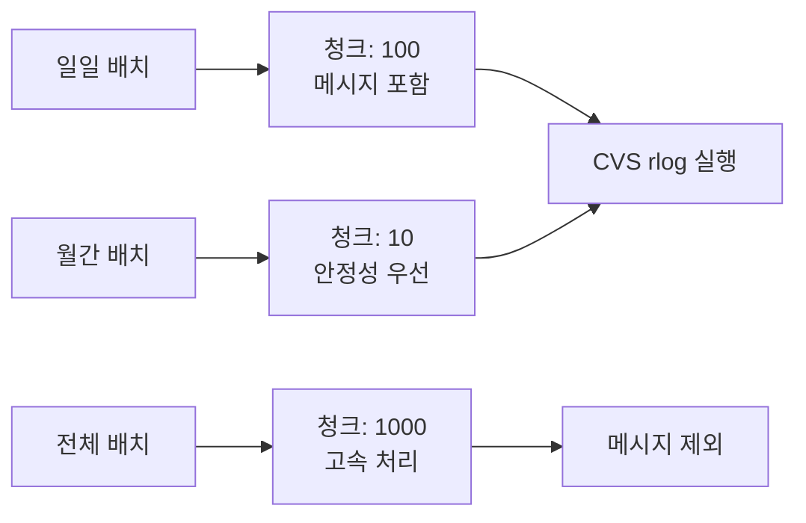
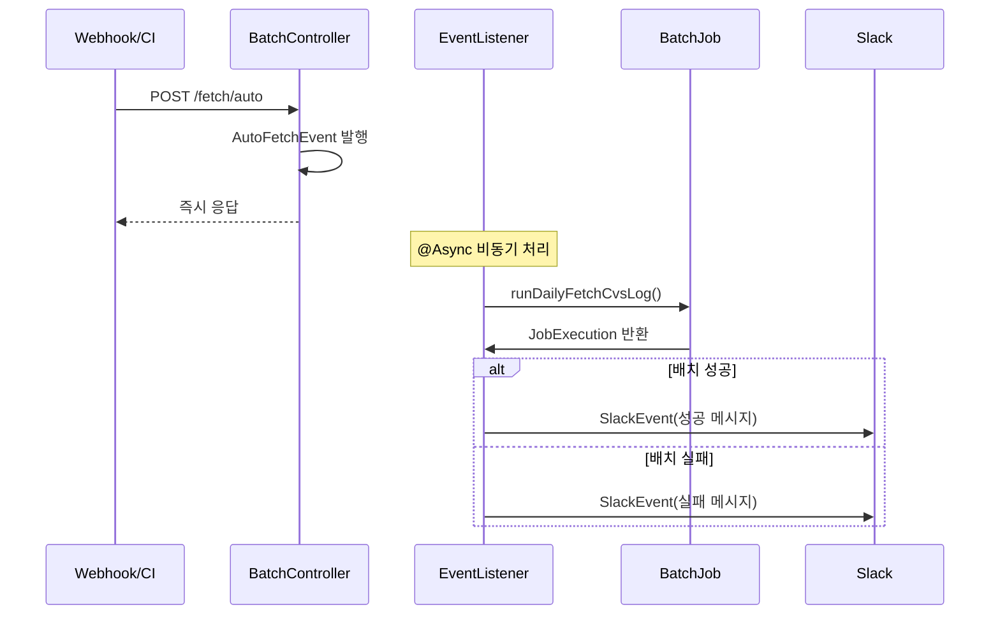
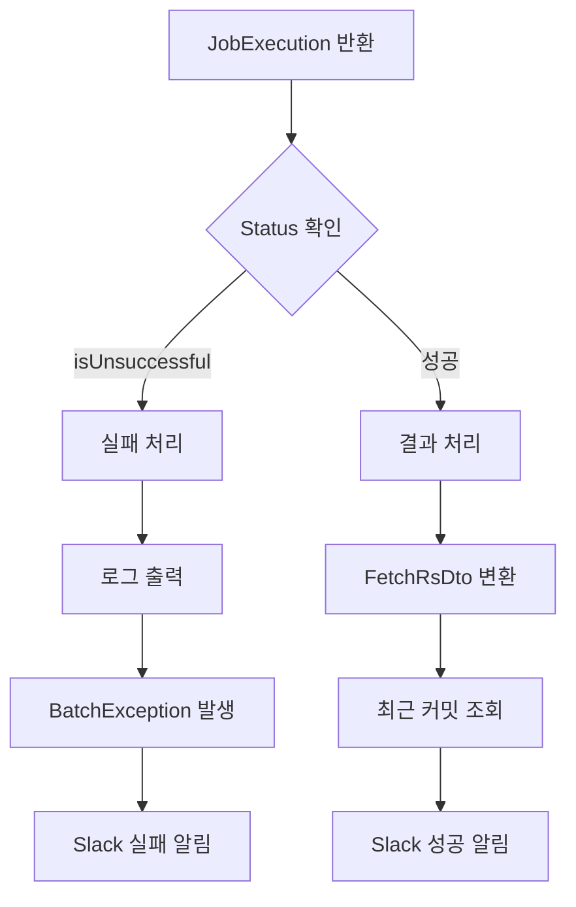
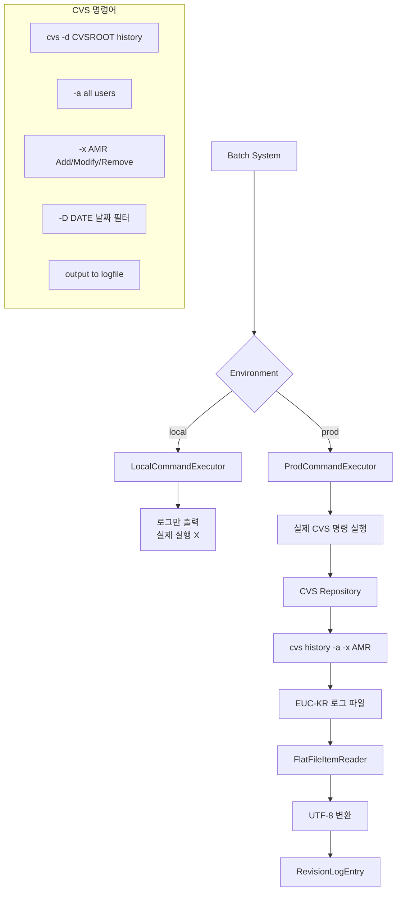
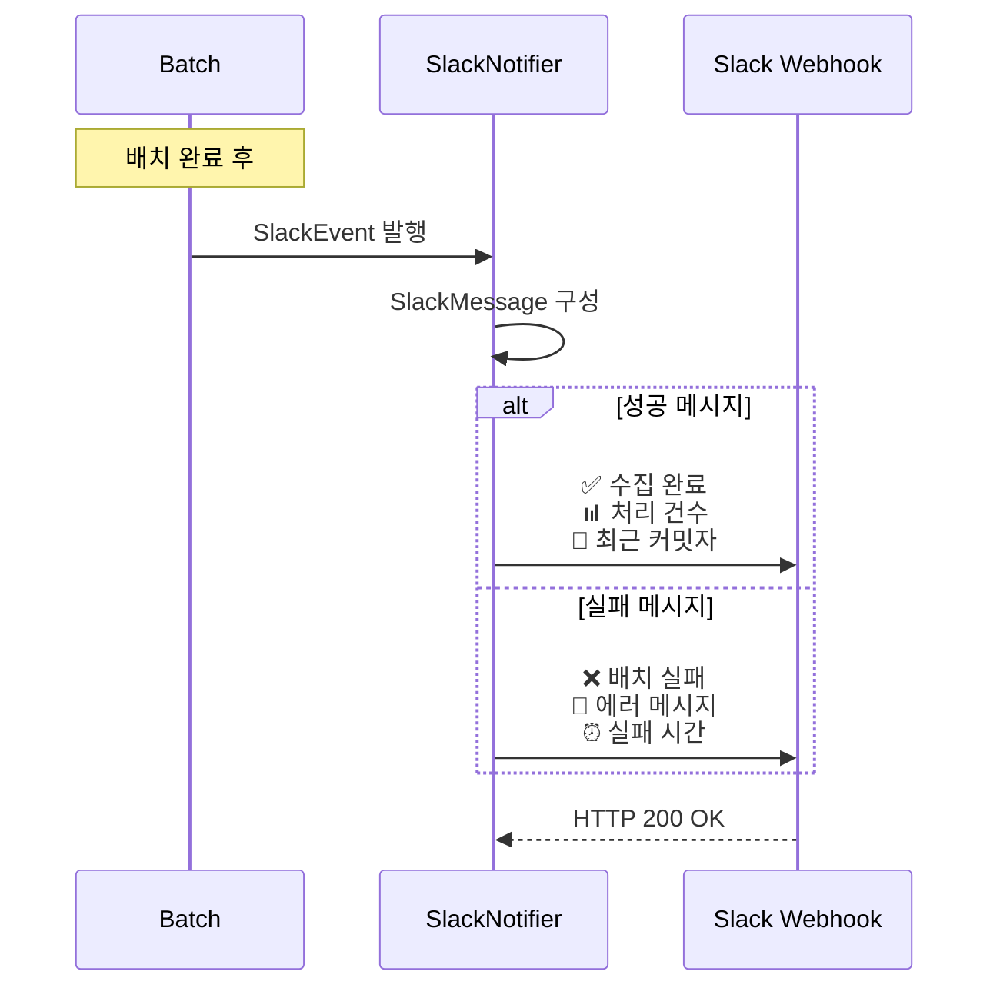
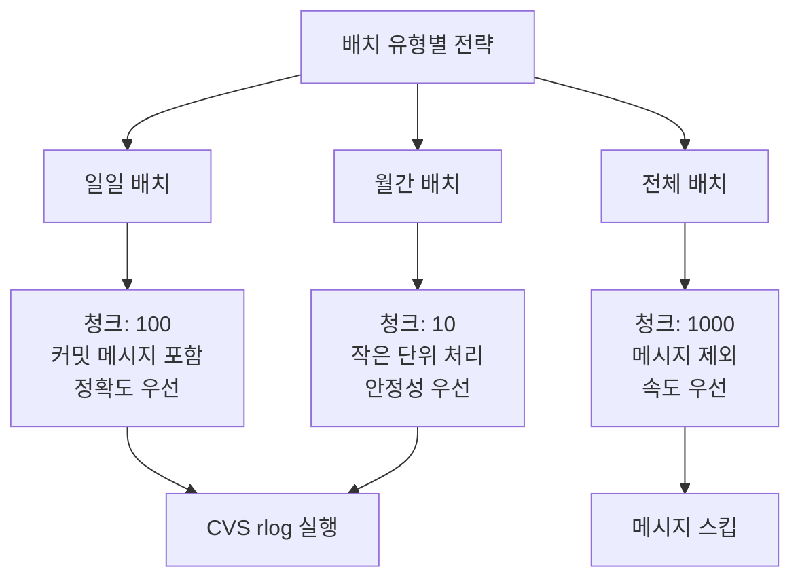
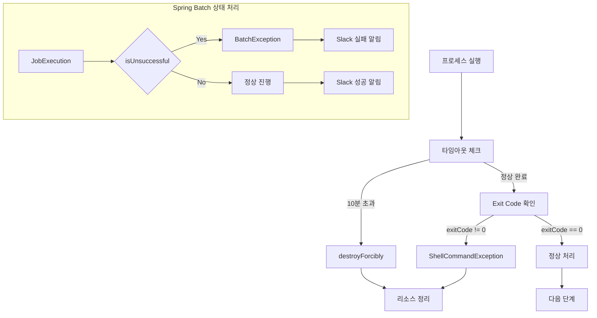
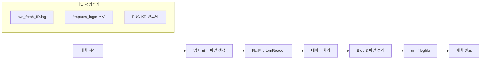

# CVSLog: CVS 로그 수집 시스템 구현


CVS 저장소의 커밋 로그를 자동으로 수집하여 관계형 데이터베이스에 저장하고 REST API로 제공하는 Spring Boot 멀티모듈 시스템입니다.

## 📋 목차

- [시스템 아키텍처](#시스템-아키텍처)
- [핵심 구현 내용](#핵심-구현-내용)
- [모듈별 구현 세부사항](#모듈별-구현-세부사항)
- [배치 처리 구현](#배치-처리-구현)
- [이벤트 기반 처리](#이벤트-기반-처리)
- [외부 시스템 연동](#외부-시스템-연동)
- [성능 및 안정성](#성능-및-안정성)
- [실행 및 배포](#실행-및-배포)

## 🏗️ 시스템 아키텍처

### 멀티모듈 구조
```
cvslog/
├── core/           # 공통 도메인 모델 및 JPA 엔티티
├── api/            # REST API 서버 (조회)
└── batch/          # CVS 로그 수집 및 배치 처리
```

### 기술 스택
- **Backend**: Spring Boot 3.3.2, Spring Batch 5.0, Java 17
- **Database**: MySQL/MariaDB + Spring Data JPA + QueryDSL
- **Build**: Gradle 8.0, 멀티모듈 프로젝트
- **External**: CVS Commands, Slack Webhook API

### 실행 환경
- **API Server**: Port 8080 (조회)
- **Batch Server**: Port 8082 (배치 처리)
- **Profile**: local(개발), prod(운영)

## 🔧 핵심 구현 내용

### 1. 도메인 모델 설계

**엔티티 관계 구조**:


**주요 엔티티**:
- `Project`: CVS 프로젝트 정보
- `User`: CVS 사용자 정보  
- `File`: 소스 파일 정보
- `Commit`: 커밋 정보 (시간, 메시지)
- `Revision`: 파일별 리비전 정보 (A/M/R)

### 2. Spring Batch 구현

**Job 구성**:
```java
// FetchCvsLogBatch.java
@Bean
public Job fetchCvsLogJob() {
    return new JobBuilder("fetchCvsLogJob", jobRepository)
        .start(fetchLogCommandStep)     // CVS 명령 실행
        .next(revisionFileToDBStep)     // 로그 파싱 및 저장
        .next(deleteFetchLogFileStep)   // 임시 파일 정리
        .build();
}
```

**청크 지향 처리**:
```java
// RevisionLogFileToDB.java
@Bean
public Step revisionFileToDBStep() {
    return new StepBuilder("RevisionFileToDBStep", jobRepository)
        .<RevisionLogEntry, Revision>chunk(chunkSize, platformTransactionManager)
        .reader(itemReader())      // FlatFileItemReader
        .processor(itemProcessor()) // CompositeItemProcessor
        .writer(itemWriter())      // JpaItemWriter
        .build();
}
```

### 3. 이벤트 기반 비동기 처리

**이벤트 발행/구독 패턴**:
```java
// AutoFetchEventListener.java
@EventListener
@Async("AutoFetchEventExecutor")
public void handleFetchEvent(AutoFetchEvent event) {
    JobExecution jobExecution = batchConfig.runDailyFetchCvsLog();
    
    // 배치 실행 상태 확인
    if(jobExecution.getStatus().isUnsuccessful()) {
        throw new BatchException("배치 실행 실패");
    }
    
    // Slack 알림 이벤트 발행
    publisher.publishEvent(new SlackEvent(slackMessage));
}
```

## 📁 모듈별 구현 세부사항

### Core 모듈: 공통 기반

**JPA 엔티티 구현**:
```java
@Entity
@Table(name = "CVS_COMMIT_HISTORY")
public class Commit extends BaseTime {
    @Id @GeneratedValue(strategy = GenerationType.IDENTITY)
    private Long id;
    
    @ManyToOne(fetch = FetchType.LAZY)
    @JoinColumn(name = "project_id")
    private Project project;
    
    @ManyToOne(fetch = FetchType.LAZY)
    @JoinColumn(name = "user_id")
    private User user;
    
    @OneToMany(mappedBy = "commit", cascade = CascadeType.ALL)
    private List<Revision> revisions = new ArrayList<>();
}
```

**QueryDSL Repository**:
```java
@Repository
public class CommitQueryRepository {
    private final JPAQueryFactory queryFactory;
    
    public Page<Commit> findCommitsWithCondition(CommitRqCond condition) {
        return PageableExecutionUtils.getPage(
            queryFactory
                .selectFrom(commit)
                .leftJoin(commit.project, project).fetchJoin()
                .leftJoin(commit.user, user).fetchJoin()
                .where(buildConditions(condition))
                .fetch(),
            pageable,
            countQuery()
        );
    }
}
```

### Batch 모듈: 핵심 처리 로직

**CVS 명령어 실행**:
```java
@Component
@Profile("prod")
public class ProdCommandExecutor implements CommandExecutor {
    
    @Override
    public void execute(String command) throws IOException, InterruptedException {
        Process process = createProcess(command);
        
        try {
            boolean finished = process.waitFor(COMMAND_TIMEOUT_MINUTE, TimeUnit.MINUTES);
            
            if (!finished) {
                process.destroyForcibly();
                throw new ShellCommandException("Command timeout");
            }
            
            int exitCode = process.exitValue();
            if (exitCode != 0) {
                throw new ShellCommandException("Command failed with exit code: " + exitCode);
            }
        } finally {
            if (process.isAlive()) {
                process.destroyForcibly();
            }
        }
    }
}
```

**로그 파싱 및 변환**:
```java
@Component
public class CvsLogUtil {
    
    public RevisionLogEntry parseLogLine(String line) {
        // CVS 로그 형식: M 2024-07-02 15:30 john.doe myproject src/main.c 1.15
        String[] parts = line.split("\\s+", 6);
        
        return RevisionLogEntry.builder()
            .revisionType(RevisionType.valueOf(parts[0]))
            .dateTime(parseDateTime(parts[1] + " " + parts[2]))
            .userName(parts[3])
            .projectName(parts[4])
            .filePath(parts[5])
            .revisionNumber(parts.length > 6 ? parts[6] : null)
            .build();
    }
}
```

**중복 체크 Processor**:
```java
@Component
public class DuplicationCheckItemProcessor implements ItemProcessor<RevisionLogEntry, RevisionLogEntry> {
    
    @Override
    public RevisionLogEntry process(RevisionLogEntry item) {
        // 기존 리비전과 중복 체크
        boolean exists = revisionRepository.existsByProjectAndFileAndRevisionNumber(
            item.getProjectName(), 
            item.getFilePath(), 
            item.getRevisionNumber()
        );
        
        return exists ? null : item; // null 반환 시 스킵
    }
}
```

### API 모듈: REST API

**컨트롤러 구현**:
```java
@RestController
@RequestMapping("/api/commits")
public class CommitController {
    
    @GetMapping
    public ResponseEntity<Page<CommitRsDto>> getCommits(
        @ModelAttribute CommitRqCond condition,
        Pageable pageable
    ) {
        Page<CommitRsDto> commits = commitService.findCommitsWithCondition(condition, pageable);
        return ResponseEntity.ok(commits);
    }
}
```

## ⚙️ 배치 처리 구현

### 배치 Job 플로우



### 배치 실행 전략



### 핵심 구현 특징

- **3단계 Step**: CVS 명령 → 파싱/저장 → 정리
- **청크 지향 처리**: 메모리 효율적인 대용량 처리
- **중복 방지**: 리비전 단위 중복 체크
- **커밋 메시지**: 개별 파일별 `cvs rlog` 실행

## 🔄 이벤트 기반 처리

### 자동 수집 플로우



### Spring Batch 상태 처리



### 핵심 특징

- **비동기 처리**: `@Async`로 웹훅 응답 즉시 반환
- **상태 확인**: Spring Batch 특성상 실패해도 JobExecution 반환
- **이벤트 체인**: AutoFetchEvent → SlackEvent 연쇄 발행
- **시간대 변환**: UTC → Asia/Seoul 자동 변환

## 🔗 외부 시스템 연동

### CVS 시스템 연동 구조



### Slack 연동 플로우



### 핵심 연동 특징

- **환경 분리**: `@Profile`로 로컬/운영 환경 구분
- **인코딩 변환**: EUC-KR → UTF-8 자동 처리
- **명령어 구성**: CVS history -a -x AMR (모든 사용자, Add/Modify/Remove)
- **Slack 알림**: 배치 결과를 구조화된 메시지로 전송

## ⚡ 성능 및 안정성

### 배치 성능 최적화



### 에러 처리 및 복구



### 리소스 관리



### 핵심 안정성 특징

- **중복 방지**: 리비전 단위 존재 여부 체크
- **타임아웃 처리**: 10분 제한 + 강제 종료
- **상태 확인**: Spring Batch JobExecution 상태 체크
- **파일 정리**: Step 단위 임시 파일 자동 삭제

## 🚀 실행 및 배포

### 환경 설정

**필수 환경변수**:
```bash
# CVS 연동
export CVSROOT=:pserver:user@cvs-server:/path/to/repository
export CVSLOGPATH=/tmp/cvs_logs

# Slack 연동
export SLACK_WEBHOOK_URL=https://hooks.slack.com/services/YOUR/SLACK/WEBHOOK

# 데이터베이스 (운영환경)
export CL_DB_URL=jdbc:mysql://prod-db:3306/cvslog
export CL_DB_USERNAME=cvslog_user
export CL_DB_PASSWORD=your_password
```

### 빌드 및 실행

```bash
# 전체 빌드
./gradlew build

# API 서버 실행 (포트: 8080)
./gradlew :api:bootRun

# Batch 서버 실행 (포트: 8082)
./gradlew :batch:bootRun --args='--spring.profiles.active=prod'
```

### API 사용 예시

```bash
# 수동 일일 배치 실행
curl -X POST http://localhost:8082/fetch

# 웹훅 기반 자동 배치 (CI/CD 연동)
curl -X POST http://localhost:8082/fetch/auto

# 최근 3개월 배치 실행
curl -X POST http://localhost:8082/fetch/recent/3

# 커밋 목록 조회
curl "http://localhost:8080/api/commits?projectName=myproject&startDate=2024-01-01&size=20"
```

---

이 시스템은 레거시 CVS를 현대적인 Spring Boot 생태계로 연결하여, 대용량 로그 데이터를 안정적으로 처리하고 편리한 조회 인터페이스를 제공합니다. Spring Batch의 청크 지향 처리와 이벤트 기반 비동기 처리를 통해 성능과 안정성을 모두 확보했습니다.