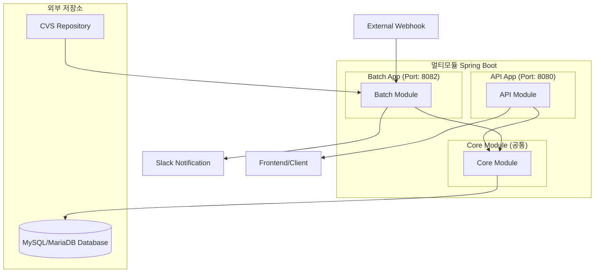
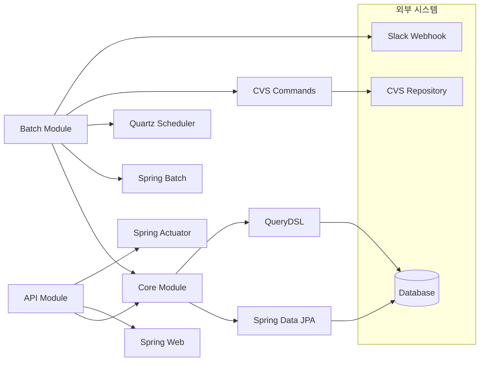
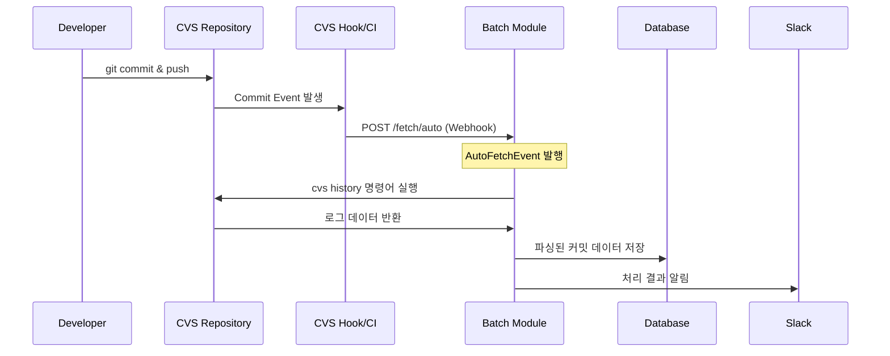
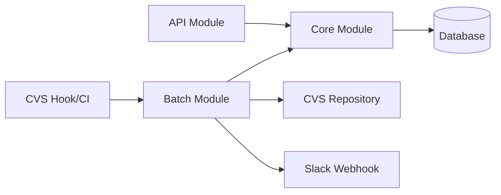
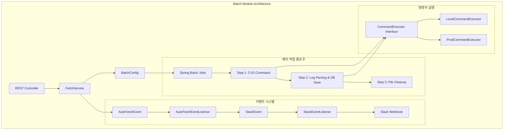
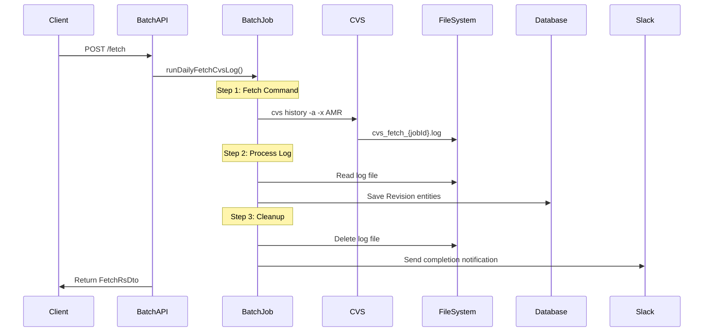

# CVSLog


CVS(Concurrent Versions System) 커밋 로그를 자동으로 수집하고 관리하는 Spring Boot 기반 멀티모듈 시스템입니다.

## 📋 목차

- [개요](#개요)
- [주요 기능](#주요-기능)
- [아키텍처](#아키텍처)
- [시작하기](#시작하기)
- [API 문서](#api-문서)
- [설정](#설정)
- [배포](#배포)
- [기여하기](#기여하기)

## 🎯 개요

CVSLog는 레거시 CVS 시스템의 커밋 히스토리를 현대적인 방식으로 관리할 수 있게 해주는 시스템입니다. Spring Batch를 활용하여 대용량 로그 데이터를 효율적으로 처리하고, REST API를 통해 편리한 조회 기능을 제공합니다.

### ✨ 주요 기능

- 🔄 **자동 로그 수집**: CVS 저장소에서 커밋 로그 자동 수집
- 📊 **대용량 처리**: Spring Batch 기반 청크 지향 처리
- 🔍 **검색 및 조회**: 프로젝트별, 사용자별, 기간별 커밋 이력 조회
- 📱 **실시간 알림**: Slack을 통한 배치 작업 결과 알림
- 📈 **모니터링**: Prometheus 메트릭을 통한 시스템 모니터링
- 🌐 **REST API**: 직관적인 RESTful API 제공

## 🏗️ 아키텍처

### 전체 시스템 구조



### 모듈 의존성 관계



### CVS 커밋 이벤트 기반 자동 수집 플로우



### 모듈 의존성 관계



### Batch 모듈 상세 구조



### 배치 작업 데이터 플로우



## 📁 프로젝트 구조

### Core Module (공통 기반)
```
core/
├── entity/
│   ├── BaseTime.java           # 공통 시간 필드
│   ├── Commit.java            # 커밋 정보
│   ├── Project.java           # 프로젝트 정보
│   ├── User.java              # 사용자 정보
│   ├── Revision.java          # 리비전 정보
│   └── File.java              # 파일 정보
├── repository/
│   ├── CommitRepository.java
│   ├── ProjectRepository.java
│   ├── UserRepository.java
│   ├── RevisionRepository.java
│   └── FileRepository.java
├── value/
│   ├── RevisionType.java      # 리비전 타입 (A/M/R)
│   └── UseType.java
└── JpaConfig.java             # JPA 설정
```

### Batch Module (핵심 처리 로직)
```
batch/
├── job/                       # 배치 작업 정의
│   ├── FetchCvsLogBatch.java     # 메인 배치 Job 설정
│   ├── FetchLogCommand.java      # CVS 명령어 실행 Step
│   ├── RevisionLogFileToDB.java  # 로그 파싱 및 저장 Step
│   ├── dto/
│   │   ├── RevisionLogEntry.java # CVS 로그 엔트리 DTO
│   │   └── LogBuffer.java
│   └── mapper/
│       ├── CvsLogUtil.java       # CVS 로그 파싱 유틸
│       └── LogToEntityMapper.java # DTO → Entity 매핑
├── command/                   # 시스템 명령어 실행
│   ├── CommandExecutor.java      # 명령어 실행 인터페이스
│   ├── LocalCommandExecutor.java # 로컬 환경용
│   ├── ProdCommandExecutor.java  # 프로덕션 환경용
│   └── OsType.java              # OS 타입 구분
├── event/                     # 이벤트 기반 처리
│   ├── AutoFetchEvent.java       # 자동 수집 이벤트
│   ├── AutoFetchEventListener.java
│   ├── SlackEvent.java           # Slack 알림 이벤트
│   └── SlackEventListener.java
├── service/
│   └── FetchService.java         # 배치 실행 서비스
├── slack/                     # Slack 통합
│   ├── SlackNotifier.java
│   └── SlackMessage.java
├── web/                       # REST API
│   ├── BatchController.java      # 배치 실행 API
│   └── response/FetchRsDto.java
└── BatchConfig.java           # 배치 설정 및 실행기
```

### API Module (REST API)
```
api/
├── controller/
│   ├── CommitController.java     # 커밋 조회 API
│   ├── ConditionController.java  # 검색 조건 API
│   └── MainController.java       # 메인 페이지 API
├── service/
│   ├── CommitService.java
│   ├── ProjectService.java
│   ├── RevisionService.java
│   └── UserService.java
├── repository/                # 조회용 Repository
│   ├── CommitQueryRepository.java
│   ├── ProjectQueryRepository.java
│   └── UserQueryRepository.java
└── dto/
    ├── request/CommitRqCond.java # 검색 조건 DTO
    └── response/              # 응답 DTO들
```

## 🔄 배치 작업 세부 사항

### 1. FetchCvsLogJob (커밋 메시지 포함)
- **청크 사이즈**: 일일(100), 월간(10)
- **처리 단계**: CVS 명령어 → 로그 파싱 → 커밋 메시지 조회 → DB 저장

### 2. FetchCvsLogJobWithoutCommitMsg (고속 처리)
- **청크 사이즈**: 1000
- **처리 단계**: CVS 명령어 → 로그 파싱 → DB 저장 (메시지 제외)

### 3. ItemProcessor 체인
```text
CompositeItemProcessor<RevisionLogEntry, Revision>
├── duplicationCheckItemProcessor    // 중복 체크
├── dtoToEntityItemProcessor        // DTO → Entity 변환
└── commitMessageItemProcessor      // 커밋 메시지 조회 (선택적)
```

## 🚀 시작하기

### 필수 요구사항

- Java 17+
- MySQL 8.0+ 또는 MariaDB 10.6+
- CVS 클라이언트 설치
- Gradle 8.0+

### 설치 및 실행

1. **저장소 클론**
   ```bash
   git clone https://github.com/your-org/cvslog.git
   cd cvslog
   ```

2. **환경 변수 설정**
   ```bash
   export CVSROOT=:pserver:user@cvs-server:/path/to/repository
   export CVSLOGPATH=/tmp/cvs_logs
   export SLACK_WEBHOOK_URL=https://hooks.slack.com/services/YOUR/SLACK/WEBHOOK
   ```

3. **데이터베이스 설정**
   ```yaml
   # core/src/main/resources/application-core.yml
   spring:
     datasource:
       url: jdbc:mysql://localhost:3306/cvslog
       username: your_username
       password: your_password
   ```

4. **빌드 및 실행**
   ```bash
   # 전체 빌드
   ./gradlew build
   
   # API 서버 실행 (포트: 8080)
   ./gradlew :api:bootRun
   
   # Batch 서버 실행 (포트: 8082)
   ./gradlew :batch:bootRun
   ```

## 📚 API 문서

### 배치 관련 API

| Method | Endpoint | 설명 |
|--------|----------|------|
| `POST` | `/fetch` | 수동 일일 로그 수집 |
| `POST` | `/fetch/auto` | 웹훅 기반 자동 수집 |
| `POST` | `/fetch/recent/{month}` | 최근 N개월 로그 수집 |
| `GET` | `/fetch` | 최근 배치 실행 결과 조회 |

### 조회 API

| Method | Endpoint | 설명 |
|--------|----------|------|
| `GET` | `/api/commits` | 커밋 목록 조회 |
| `GET` | `/api/projects` | 프로젝트 목록 조회 |
| `GET` | `/api/users` | 사용자 목록 조회 |
| `GET` | `/api/conditions` | 검색 조건 조회 |

### 예시 요청

```bash
# 일일 로그 수집
curl -X POST http://localhost:8082/fetch

# 커밋 목록 조회
curl "http://localhost:8080/api/commits?projectName=myproject&startDate=2024-01-01"
```

## ⚙️ 설정

### 환경별 설정

#### Local 환경
```yaml
spring:
  profiles:
    active: local
  batch:
    job:
      enabled: false
```

#### Production 환경
```yaml
spring:
  profiles:
    active: prod
  datasource:
    hikari:
      maximum-pool-size: 4
```

### 배치 작업 설정

```yaml
# 청크 사이즈 설정
job:
  chunk-size:
    daily: 100
    monthly: 10
    full: 1000
```

## 🐳 배포

### Docker Compose

```yaml
version: '3.8'
services:
  mysql:
    image: mysql:8.0
    environment:
      MYSQL_ROOT_PASSWORD: rootpass
      MYSQL_DATABASE: cvslog
    ports:
      - "3306:3306"

  api:
    build: 
      context: .
      dockerfile: api/Dockerfile
    ports:
      - "8080:8080"
    depends_on:
      - mysql

  batch:
    build:
      context: .
      dockerfile: batch/Dockerfile
    ports:
      - "8082:8082"
    depends_on:
      - mysql
```

### Kubernetes

```yaml
apiVersion: apps/v1
kind: Deployment
metadata:
  name: cvslog-api
spec:
  replicas: 2
  selector:
    matchLabels:
      app: cvslog-api
  template:
    metadata:
      labels:
        app: cvslog-api
    spec:
      containers:
        - name: api
          image: cvslog/api:latest
          ports:
            - containerPort: 8080
```

## 📊 모니터링

### Prometheus 메트릭

- **HTTP 요청 메트릭**: 응답시간, 에러율
- **배치 작업 메트릭**: 실행시간, 처리량
- **데이터베이스 메트릭**: 커넥션 풀, 쿼리 성능

### Slack 알림

배치 작업 완료/실패 시 자동으로 Slack 알림이 전송됩니다:

```
✅ CVS 로그 수집 완료
📊 처리된 커밋: 156건
👤 최근 커밋: john.doe
📝 메시지: "Fix critical bug in user authentication"
🏷️ 프로젝트: myproject
⏰ 시간: 2024-07-02 15:30:25
```

## 🔧 개발

### 로컬 개발 환경

1. **테스트 실행**
   ```bash
   ./gradlew test
   ```

2. **코드 스타일 검사**
   ```bash
   ./gradlew checkstyleMain
   ```

3. **로컬 프로필로 실행**
   ```bash
   ./gradlew :api:bootRun --args='--spring.profiles.active=local'
   ```

### 기여 가이드

1. Fork 후 브랜치 생성
2. 기능 개발 또는 버그 수정
3. 테스트 코드 작성
4. Pull Request 생성

## 📄 라이선스

이 프로젝트는 MIT 라이선스 하에 있습니다. 자세한 내용은 [LICENSE](LICENSE) 파일을 참조하세요.

## 🤝 지원

- **이슈 리포팅**: [GitHub Issues](https://github.com/your-org/cvslog/issues)
- **기능 요청**: [GitHub Discussions](https://github.com/your-org/cvslog/discussions)
- **문서**: [Wiki](https://github.com/your-org/cvslog/wiki)

---

Made with ❤️ by [Your Organization](https://github.com/your-org)