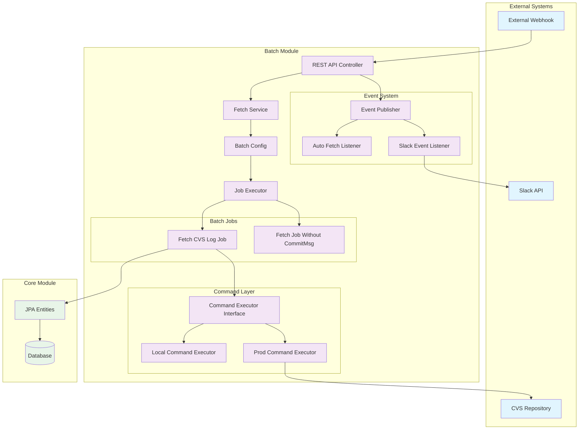
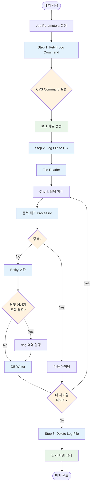
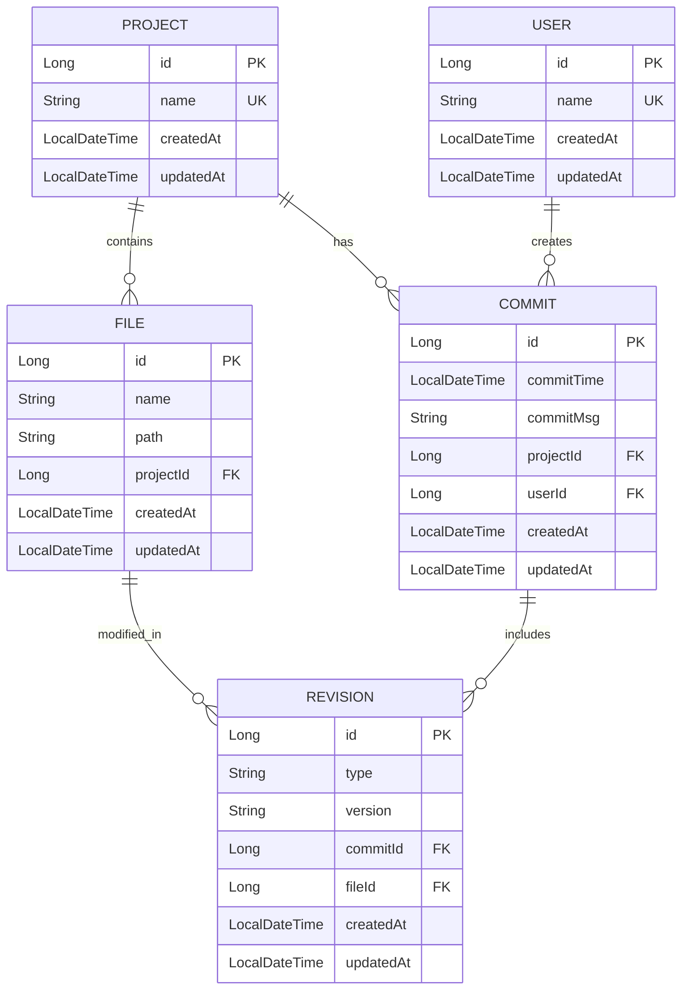
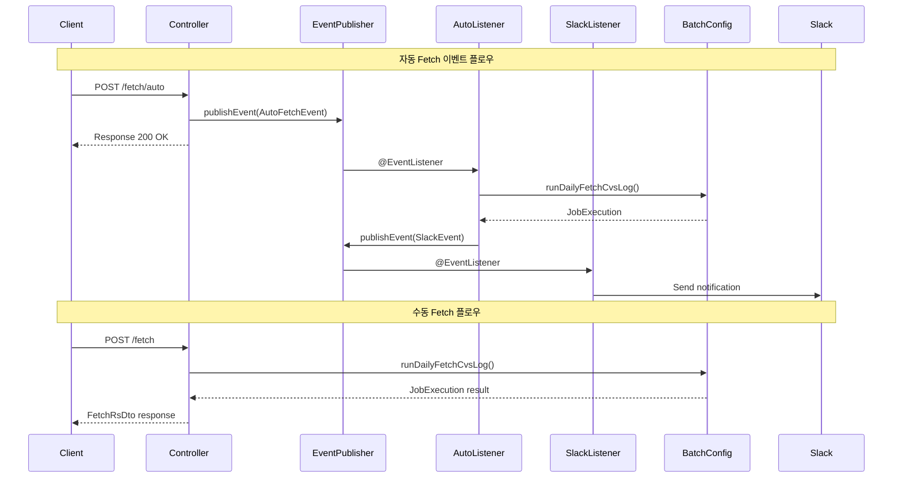
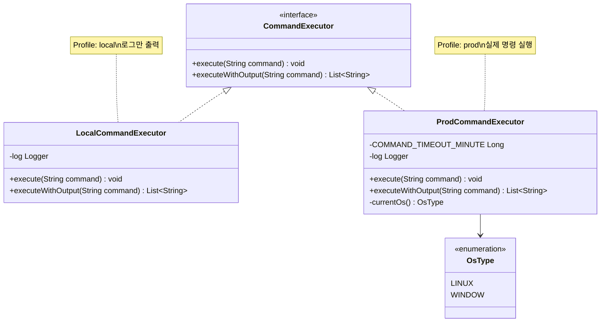
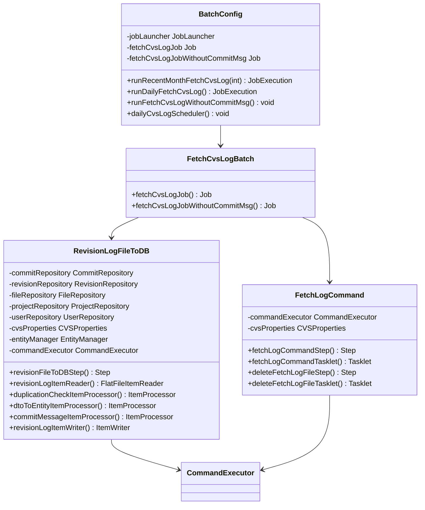

# Batch 모듈 분석 보고서

## 1. 개요

CVS Repository 관련 배치 처리 시스템으로, CVS 로그를 수집하고 데이터베이스에 저장하는 기능을 제공합니다. Spring Boot와 Spring Batch를 기반으로 구축되었으며, 스케줄링과 수동 실행을 모두 지원합니다.

## 2. 아키텍처 및 구조

### 2.1 전체 시스템 아키텍처



### 2.2 기술 스택
- **Framework**: Spring Boot 3.x, Spring Batch
- **스케줄링**: Spring Quartz, Spring Scheduling
- **외부 연동**: Slack 알림, CVS 시스템
- **런타임**: Java 17+
- **데이터베이스**: Core 모듈의 JPA 엔티티 공유

### 2.3 모듈 구조
```
batch/
├── src/main/java/com/srpinfotec/
│   ├── BatchApplication.java          # 메인 애플리케이션 클래스
│   └── batch/
│       ├── BatchConfig.java           # 배치 설정 및 실행 관리
│       ├── command/                   # 시스템 명령 실행
│       ├── cvs/                      # CVS 관련 설정
│       ├── event/                    # 이벤트 처리
│       ├── exception/                # 예외 처리
│       ├── job/                      # 배치 작업 정의
│       ├── service/                  # 비즈니스 로직
│       ├── slack/                    # Slack 연동
│       └── web/                      # REST API 컨트롤러
└── src/main/resources/
    ├── application.yml
    ├── application-cvs.yml
    ├── application-slack.yml
    └── logback-spring.xml
```

## 3. 핵심 기능

### 3.1 배치 작업 (Batch Jobs)

#### 3.1.1 FetchCvsLogJob (메인 배치)
- **목적**: CVS 커밋 로그 수집 및 DB 저장 (커밋 메시지 포함)
- **실행 순서**:
    1. `fetchLogCommandStep`: CVS history 명령 실행
    2. `revisionFileToDBStep`: 로그 파일 파싱 및 DB 저장
    3. `deleteFetchLogFileStep`: 임시 로그 파일 삭제

#### 3.1.2 FetchCvsLogJobWithoutCommitMsg (경량 배치)
- **목적**: 커밋 메시지 없이 빠른 로그 수집
- **실행 순서**: 메인 배치와 동일하나 커밋 메시지 조회 단계 제외

### 3.2 명령 실행 시스템

#### 3.2.1 CommandExecutor 인터페이스
```java
public interface CommandExecutor {
    void execute(String command);
    List<String> executeWithOutput(String command);
}
```

#### 3.2.2 구현체
- **LocalCommandExecutor**: 로컬 환경용 (로그만 출력)
- **ProdCommandExecutor**: 운영 환경용 (실제 명령 실행)
    - Linux/Windows 환경 자동 감지
    - 10분 타임아웃 설정
    - 에러 스트림 리다이렉션

### 3.3 CVS 연동

#### 3.3.1 주요 CVS 명령어
```bash
# 히스토리 조회
cvs -d ${CVSROOT} history -a -x AMR -D ${DATE} > ${LOG_FILE}

# 커밋 메시지 조회
cvs -d ${CVSROOT} rlog ${FILE_PATH} | iconv -f EUC-KR -t UTF-8
```

#### 3.3.2 CVS 설정 (CVSProperties)
- `CVSROOT`: CVS 저장소 루트
- `CVSLOGPATH`: 로그 파일 저장 경로
- 환경변수 기반 설정

## 4. 데이터 처리 플로우

### 4.1 배치 작업 플로우



### 4.2 로그 수집 프로세스
1. **명령 실행**: CVS history 명령으로 로그 추출
2. **파일 파싱**: FlatFileItemReader로 로그 파일 읽기
3. **중복 체크**: 기존 리비전과 중복 확인
4. **엔티티 변환**: 로그 데이터를 JPA 엔티티로 변환
5. **커밋 메시지 조회**: 개별 파일별 rlog 명령 실행
6. **데이터 저장**: 배치 단위로 데이터베이스 저장

### 4.3 엔티티 관계도



### 4.4 엔티티 매핑
- **RevisionLogEntry** → **Revision**
- **Project**, **User**, **File**, **Commit** 엔티티 자동 생성
- 자연키 기반 중복 방지

### 4.5 에러 처리
- **SkipPolicy**: 파싱 에러 최대 3회까지 허용
- **타임아웃**: 명령 실행 10분 제한
- **예외 처리**: BatchException, ShellCommandException

## 5. API 엔드포인트

### 5.1 배치 실행 API
```
POST /fetch                    # 일일 로그 수집 (수동)
POST /fetch/auto              # 자동 웹훅 트리거
POST /fetch/recent/{month}    # 최근 N개월 로그 수집
GET  /fetch                   # 최근 실행 결과 조회
```

### 5.2 응답 형식
```json
{
  "status": "COMPLETED",
  "writeCount": 150,
  "lastUpdated": "2024-07-02T10:30:00"
}
```

## 6. 이벤트 시스템

### 6.1 이벤트 플로우



### 6.2 자동 Fetch 이벤트
- **AutoFetchEvent**: 웹훅 기반 자동 실행
- **AutoFetchEventListener**: 이벤트 처리 및 배치 실행

### 6.3 Slack 알림
- **SlackEvent**: 알림 이벤트
- **SlackEventListener**: Slack 메시지 전송
- **SlackNotifier**: 실제 Slack API 호출

## 7. 설정 및 프로파일

### 7.1 프로파일별 설정
- **local**: 개발 환경 (DB 스키마 자동 생성, 포트 8082)
- **prod**: 운영 환경 (환경변수 기반 설정)

### 7.2 주요 설정
```yaml
spring:
  batch:
    job:
      enabled: false          # 자동 실행 비활성화
      name: ${job.name=NONE}  # 특정 Job 실행 지정
```

## 8. 클래스 다이어그램

### 8.1 Command 실행 계층



### 8.2 배치 작업 계층



## 9. 장점 및 특징

### 9.1 장점
- **모듈화**: 명확한 책임 분리와 인터페이스 기반 설계
- **환경 대응**: 로컬/운영 환경별 구현체 자동 선택
- **에러 복원력**: Skip Policy와 타임아웃을 통한 장애 대응
- **실시간 연동**: 웹훅 기반 즉시 실행 지원
- **중복 방지**: 자연키 기반 중복 데이터 차단

### 9.2 배치 처리 특징
- **청크 기반**: 대용량 데이터 효율적 처리
- **트랜잭션**: Step별 트랜잭션 관리
- **재시작**: Job 실행 상태 관리 및 재시작 지원

## 10. 개선 고려사항

### 10.1 성능 개선
- 커밋 메시지 조회 시 개별 rlog 명령 실행으로 인한 성능 저하
- 배치 크기 조정을 통한 메모리 사용량 최적화

### 10.2 모니터링
- 배치 실행 상태 및 에러 로그 모니터링 강화
- Slack 알림 외 추가 모니터링 도구 연동

### 10.3 확장성
- 다양한 VCS 시스템 지원 (Git, SVN 등)
- 멀티 프로젝트 동시 처리 지원

## 11. 결론

CVS 로그 수집 및 처리를 위한 안정적이고 확장 가능한 배치 시스템입니다. Spring Batch의 강력한 기능을 활용하여 대용량 데이터 처리와 에러 복원력을 제공하며, 웹훅과 API를 통한 실시간 연동도 지원합니다. 레거시 CVS 시스템과의 원활한 연동을 위해 인코딩 변환과 명령어 최적화가 잘 구현되어 있습니다.